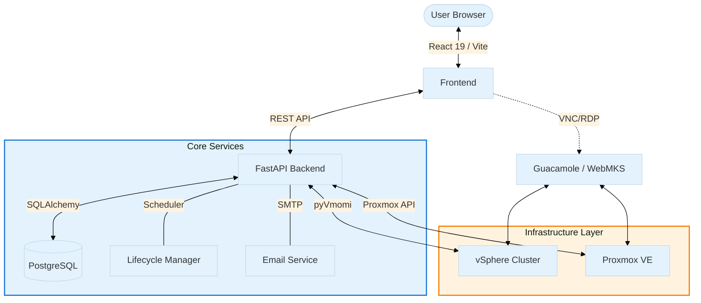

# Training Portal

<p align="center">
  
  
  
  
  
  
</p>

### **The Enterprise Blueprint for Virtualized Hands-on Learning.**

A modern, high-performance training management platform designed to orchestrate complex lab environments across high-tier hypervisors. Empower instructors to deploy isolated, multi-VM environments on-demand with professional-grade monitoring and networking control.

[**Documentation**](docs/DEVELOPER_GUIDE.md) | [**API Specs**](http://localhost:8000/docs) | [**Contributing**](#contributing)

---

##  What Makes This Different?

Traditional training platforms require complex manual setup, vendor lock-in, and limited networking capabilities. **Training Portal** provides:

- **Multi-Hypervisor Freedom** – Deploy to vSphere, Proxmox, or hybrid environments without vendor lock-in
- **Visual Network Designer** – Drag-and-drop topology builder with automatic port group/bridge creation
- **True Isolation** – Per-student VLAN segmentation and resource pool separation
- **Zero Client Installs** – Browser-based console access (WebMKS, VNC, RDP) with no downloads
- **Real-Time Intelligence** – Live VM metrics, automatic lifecycle management, and comprehensive auditing
- **One-Command Deploy** – Complete Docker Compose stack for instant production-ready deployment

---

<details>
<summary><b>System Architecture</b> (Click to expand)</summary>



</details>


## Feature Highlights

### For Instructors

<table>
<tr>
<td width="50%">

**Template Management**
- Define multi-VM lab blueprints with visual networking
- Support for vSphere linked clones and Proxmox full clones
- Template library with smart filtering (VM types, providers)
- Network topology designer with drag-and-drop interface

</td>
<td width="50%">

**Class Orchestration**
- Create scheduled classes with auto-provisioning
- Automated lifecycle: Draft → Upcoming → Active → Completed
- Per-class datastore selection for storage optimization
- Bulk operations: start/stop/revert all student environments

</td>
</tr>
<tr>
<td>

**Advanced Networking**
- Visual network topology editor
- Automatic VLAN/port group creation for vSphere
- Linux bridge configuration for Proxmox
- NIC adapter type detection (VMXNET3, VirtIO, E1000)
- Per-NIC settings: MAC, MTU, firewall, link state

</td>
<td>

**Monitoring & Control**
- Real-time VM performance metrics (CPU, RAM, Disk)
- System-wide class and environment dashboards
- Granular action logs with user attribution
- Task tracking for provisioning operations

</td>
</tr>
</table>

### For Students

<table>
<tr>
<td width="50%">

**My Workspace**
- Self-service environment access
- One-click VM power operations
- Browser-based console (no client software)
- Download RDP/SSH connection files

</td>
<td width="50%">

**Seamless Access**
- Azure AD SSO or local authentication
- Email verification with SMTP codes
- Role-based access control (RBAC)
- Guest join with class passcodes

</td>
</tr>
</table>

### For Administrators

- **User Management** – Invite, activate, deactivate, and role assignment
- **Permissions & Groups** – Granular RBAC with custom permission clusters
- **System Logs** – Dual-tab logging for actions and application exceptions
- **Provider Settings** – Configure vSphere, Proxmox, SMTP, and Azure AD from UI
- **Infrastructure Explorer** – Browse and sync resources from connected hypervisors

---

## Quick Start

### **Option 1: Docker Compose (Recommended)**

Get the entire stack running in under 60 seconds:

```bash
# Clone repository
git clone https://github.com/alshawwaf/se-training-portal.git
cd se-training-portal

# Configure environment
cp .env.example .env
# Edit .env with your settings

# Launch
docker-compose up --build -d
```

**Access:** Navigate to [http://localhost:9999](http://localhost:9999)  
**Login:** `admin@example.com` / `Cpwins!1` (configurable in `.env`)

---

### **Option 2: Development Mode**

For local development with hot-reload:

**Backend:**
```bash
cd backend
python -m venv .venv
.venv\Scripts\activate  # Windows
# source .venv/bin/activate  # Linux/Mac
pip install -r requirements.txt
uvicorn main:app --reload
```

**Frontend** (new terminal):
```bash
cd frontend
npm install
npm run dev
```

**Frontend:** [http://localhost:9999](http://localhost:9999)  
**Backend API Docs:** [http://localhost:8000/docs](http://localhost:8000/docs)

---

## Configuration

### Environment Variables (`.env`)

```env
# ============================================================================
# REQUIRED VARIABLES
# ============================================================================
# Database
DATABASE_URL=postgresql://admin:password@db:5432/training_portal

# Superadmin Account
SUPERADMIN_EMAIL=admin@example.com
SUPERADMIN_PASSWORD=Cpwins!1

# Frontend URL
FRONTEND_URL=http://localhost:9999

# Guacamole Secret (generate with: python -c "import secrets; print(secrets.token_hex(16))")
GUACAMOLE_SECRET_KEY=REDACTED_GUACAMOLE_SECRET_KEY

# ============================================================================
# OPTIONAL VARIABLES (Leave empty if not needed)
# ============================================================================
# Azure AD SSO (Optional - for enterprise single sign-on)
AZURE_CLIENT_ID=
AZURE_CLIENT_SECRET=
AZURE_TENANT_ID=

# Allowed email domains for registration (comma-separated)
ALLOWED_DOMAINS=example.com

# Guacamole URLs (defaults work for Docker Compose)
GUACAMOLE_URL=http://guacamole:8080/guacamole
GUACAMOLE_EXTERNAL_URL=http://localhost:8085/guacamole

# vSphere (Optional - Can be configured in Settings > Private Cloud instead)
VSPHERE_HOST=
VSPHERE_USER=administrator@vsphere.local
VSPHERE_PASSWORD=
VSPHERE_PORT=443
VSPHERE_VERIFY_SSL=false

# Advanced
LOG_LEVEL=INFO
BACKEND_WS_URL=ws://localhost:8000
PROVISIONING_MODE=parallel
```

> **Note:**  
> **Proxmox** and **SMTP/Email** settings are configured via the **Settings** page in the UI.  
> **vSphere** can also be configured via UI (recommended over environment variables).


---

## Infrastructure Provider Support

| Feature | VMware vSphere | Proxmox VE | Notes |
|:--------|:--------------:|:----------:|:------|
| **VM Cloning** | Linked & Full | Full Clone | vSphere linked clones reduce storage |
| **Network Isolation** | Per-Port VLAN | VLAN Bridges | Requires dvSwitch for vSphere |
| **Console Access** | WebMKS / noVNC | noVNC / SPICE | Browser-based, zero client install |
| **Snapshots** | Create & Revert | Create & Revert | Template prep & student reset |
| **NIC Types** | VMXNET3, E1000, E1000e | VirtIO, Realtek, E1000 | Auto-detected from hypervisor |
| **Resource Pools** | DRS Integration | Pool Isolation | Logical resource separation |
| **Datastore Selection** | Per-Class Choice | Default Storage | vSphere supports multi-datastore |

### vSphere Requirements for Network Isolation

For **per-student VLAN isolation**, your vSphere environment needs:

| Component | Requirement |
|:----------|:------------|
| **License** | vSphere Enterprise Plus (for Distributed vSwitch) |
| **Network** | Distributed vSwitch (dvSwitch) |
| **Port Binding** | Early Binding or Static Binding |
| **Physical Switch** | Trunk port with VLAN range (default: 100-3999) |

> **Note:** Standard vSwitch does NOT support per-port VLAN overrides. Use **Shared** network mode if dvSwitch is unavailable.

---

## Project Structure

```
training-portal/
├── backend/                      # FastAPI Application
│   ├── db/
│   │   ├── models.py            # SQLAlchemy ORM Models
│   │   └── database.py          # Database Session Management
│   ├── routers/                 # API Route Controllers
│   │   ├── auth.py              # Authentication & SSO
│   │   ├── classes.py           # Class Management
│   │   ├── templates.py         # Template CRUD
│   │   ├── networks.py          # Network Designer API
│   │   ├── infrastructure_connections.py  # Provider Config
│   │   └── ...
│   ├── services/                # Business Logic Layer
│   │   ├── vsphere_service.py   # vSphere Integration (pyVmomi)
│   │   ├── proxmox_service.py   # Proxmox Integration
│   │   ├── provisioning_service.py  # VM Cloning Orchestration
│   │   ├── email_service.py     # SMTP Email Verification
│   │   ├── guacamole_service.py # Remote Console Ticket Generation
│   │   └── class_status_scheduler.py  # Automated Lifecycle Manager
│   ├── main.py                  # FastAPI Application Entry
│   └── Dockerfile
│
├── frontend/                    # React 19 SPA
│   ├── src/
│   │   ├── components/          # Reusable UI Components
│   │   │   ├── Layout.tsx       # App Shell with Navigation
│   │   │   ├── templates/       # Template-specific Components
│   │   │   ├── classes/         # Class Management Components
│   │   │   └── monitoring/      # Admin Monitoring Components
│   │   ├── pages/               # Route Pages
│   │   │   ├── Dashboard.tsx    # Main Landing
│   │   │   ├── Templates.tsx    # Template Management
│   │   │   ├── NetworkDesigner.tsx  # Visual Topology Editor
│   │   │   ├── Classes.tsx      # Class Creation & Management
│   │   │   ├── Settings.tsx     # Provider & System Config
│   │   │   ├── MyEnvironments.tsx  # Student Workspace
│   │   │   └── monitoring/      # Admin Views
│   │   ├── context/             # React Context Providers
│   │   │   ├── AuthContext.tsx  # User Session State
│   │   │   └── ToastContext.tsx # Notification System
│   │   ├── api.ts               # Axios HTTP Client
│   │   └── App.tsx              # Root Component & Router
│   ├── package.json
│   ├── vite.config.ts           # Vite Build Configuration
│   └── Dockerfile
│
├── guacamole/                   # Apache Guacamole Config
│   ├── guacamole.properties
│   └── user-mapping.xml
│
├── docs/
│   └── DEVELOPER_GUIDE.md       # Detailed Development Docs
│
├── docker-compose.yml           # Multi-Container Orchestration
├── .env.example                 # Environment Variable Template
└── README.md                    # This file
```

---

## API Reference

### Base URL
- **Development:** `http://localhost:8000`
- **Production:** Your configured `BACKEND_URL`

### Authentication

| Method | Endpoint | Description |
|:-------|:---------|:------------|
| `GET` | `/auth/login` | Initiate Azure AD SSO login |
| `GET` | `/auth/callback` | Azure AD callback handler |
| `POST` | `/auth/local-login` | Local superadmin authentication |
| `POST` | `/auth/register` | New user registration |
| `POST` | `/auth/verify-email` | Email verification with code |

### Classes

| Method | Endpoint | Description |
|:-------|:---------|:------------|
| `GET` | `/classes/` | List all classes |
| `POST` | `/classes/` | Create a new class |
| `GET` | `/classes/{id}` | Get class details |
| `PUT` | `/classes/{id}` | Update class information |
| `DELETE` | `/classes/{id}` | Delete a class |
| `POST` | `/classes/{id}/provision` | Provision student environments |
| `POST` | `/classes/{id}/start-all` | Start all VMs in class |
| `POST` | `/classes/{id}/stop-all` | Stop all VMs in class |

### Templates

| Method | Endpoint | Description |
|:-------|:---------|:------------|
| `GET` | `/templates/` | List all templates |
| `POST` | `/templates/` | Create a new template |
| `GET` | `/templates/{id}` | Get template details |
| `PUT` | `/templates/{id}` | Update template configuration |
| `DELETE` | `/templates/{id}` | Delete a template |
| `PUT` | `/templates/{id}/status` | Change template status |

### Networks

| Method | Endpoint | Description |
|:-------|:---------|:------------|
| `GET` | `/networks/` | List all defined networks |
| `POST` | `/networks/` | Create a new network |
| `GET` | `/networks/available` | Get infrastructure networks |
| `GET` | `/networks/templates/{id}/detect-nics` | Detect NICs for template VMs |
| `POST` | `/networks/templates/{id}/save-topology` | Save network topology |
| `POST` | `/networks/create-infrastructure` | Create port group/bridge |

### Infrastructure Connections

| Method | Endpoint | Description |
|:-------|:---------|:------------|
| `GET` | `/infrastructure-connections/` | List all provider connections |
| `POST` | `/infrastructure-connections/` | Add vSphere/Proxmox connection |
| `PUT` | `/infrastructure-connections/{id}` | Update connection settings |
| `DELETE` | `/infrastructure-connections/{id}` | Remove a connection |
| `POST` | `/infrastructure-connections/{id}/test` | Test connection credentials |

**Full API Documentation:** [http://localhost:8000/docs](http://localhost:8000/docs) (Swagger UI)

---

## Development Workflow

### Running Tests

```bash
# Backend tests
cd backend
pytest

# Frontend tests
cd frontend
npm test
```

### Building for Production

```bash
# Build Docker images
docker-compose build

# Run in production mode
docker-compose up -d
```

### Database Migrations

```bash
# Access backend container
docker-compose exec backend bash

# Run Alembic migrations (when implemented)
alembic upgrade head
```

### Viewing Logs

```bash
# All services
docker-compose logs -f

# Specific service
docker-compose logs -f backend
docker-compose logs -f frontend

# Backend application logs
tail -f backend/logs/app.log
tail -f backend/logs/vsphere.log
```

---

## Security Considerations

- **Authentication:** Supports Azure AD SSO with MSAL and local superadmin fallback
- **RBAC:** Role-based permissions (Admin, Instructor, Student) with granular controls
- **Audit Logging:** All actions logged with user attribution and timestamps
- **Credential Storage:** Environment variables and database encryption for sensitive data
- **CORS:** Configurable allowed origins for production security
- **Email Verification:** Self-registration requires email verification codes

---

## Contributing

We welcome contributions! Here's how to get started:

1. **Fork** the repository
2. **Create** a feature branch: `git checkout -b feature/amazing-feature`
3. **Commit** your changes: `git commit -m 'Add amazing feature'`
4. **Push** to your branch: `git push origin feature/amazing-feature`
5. **Open** a Pull Request

### Development Guidelines

- Follow existing code style and structure
- Add comprehensive comments for complex logic
- Update documentation for new features
- Test changes thoroughly before submitting PR
- See [DEVELOPER_GUIDE.md](docs/DEVELOPER_GUIDE.md) for detailed guidelines

---

## License

This project is proprietary software developed by **Training Portal Team**  
All rights reserved.

---

## Support & Resources

- **Developer Guide:** [docs/DEVELOPER_GUIDE.md](docs/DEVELOPER_GUIDE.md)
- **API Documentation:** [http://localhost:8000/docs](http://localhost:8000/docs)
- **Report Issues:** [GitHub Issues](https://github.com/alshawwaf/se-training-portal/issues)
- **Contact:** For enterprise support inquiries

---

<p align="center">
  <b>Built for Security Engineering Training Excellence</b>
</p>
